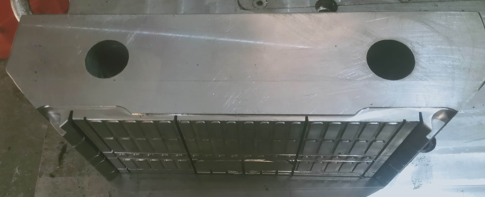
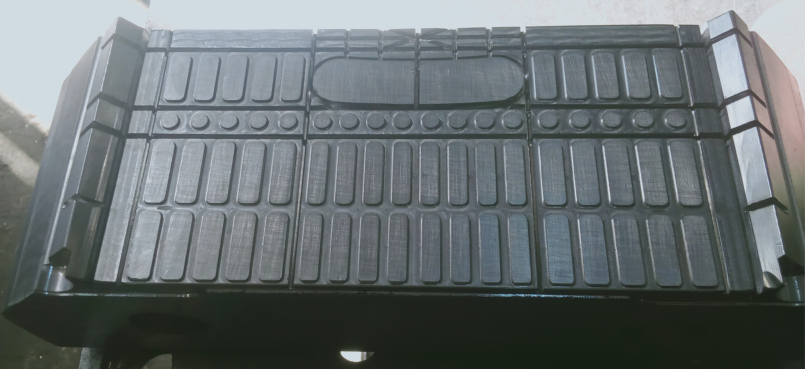
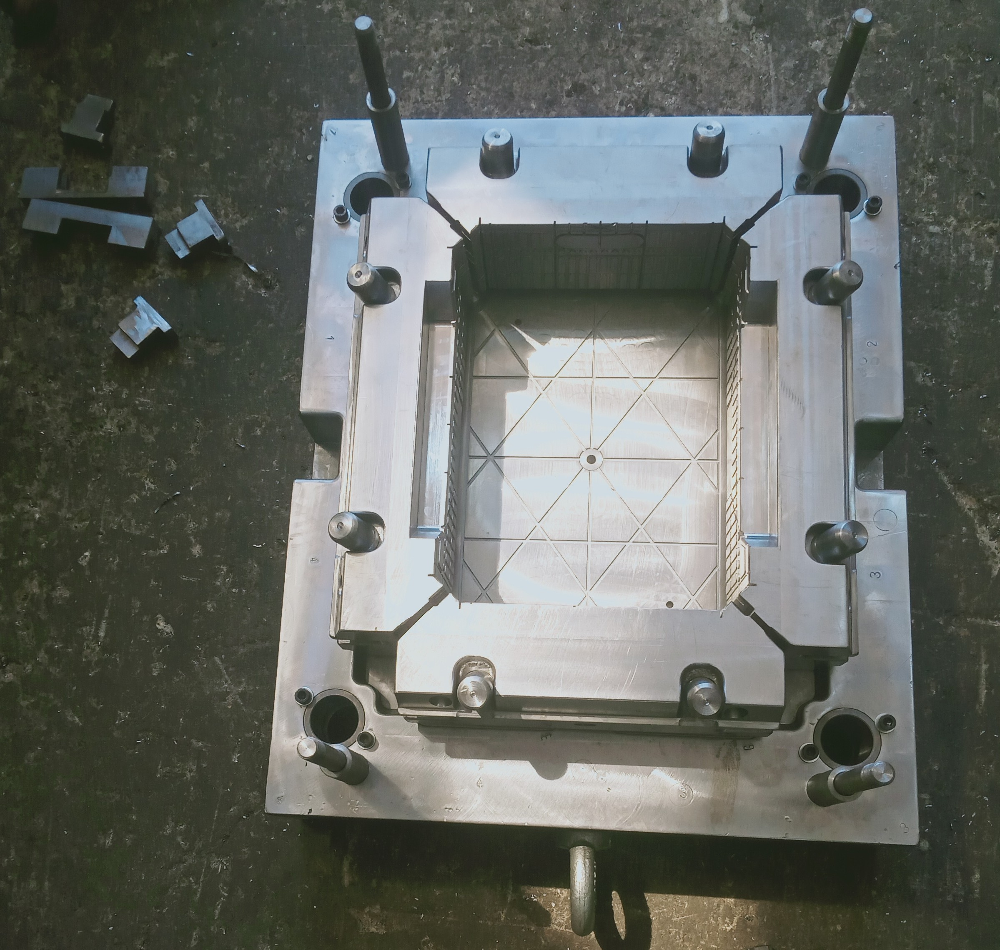

# cnc_molds

# CNC Engineering Projects

## Abstract
Experienced in **designing, programming, and operating CNC machines** for the manufacture of precision injection molds used in plastic packaging (trays and containers) for fruits and vegetables. Skilled in **mechanical modeling, CNC programming, process optimization, and project management** to ensure high-quality production and efficiency.

## Experience

**CNC Engineer | Master Company | 6th of October City, Cairo, Egypt**  
*Jan 2025 – Present*  
- Programmed and operated CNC machines for the manufacture of injection molds.  
- Prepared and optimized CNC programs, monitored machine performance, and ensured strict quality standards.  
- Collaborated with the production team to maintain smooth workflow and high efficiency.

**CNC Engineer | MZ Advanced Industries Company | Alexandria, Egypt**  
*Jul 2023 – Aug 2024*  
- Designed and developed precision 3D mechanical models using **SolidWorks** for injection molds.  
- Programmed and optimized CNC machining processes using **PowerMILL** to improve efficiency, reduce material waste, and maintain strict quality standards.  
- Developed different mold types tailored to diverse applications, ensuring high accuracy, efficiency, and product quality.  
- Worked closely with the production team to streamline workflows and reduce operational costs.

## Projects

### CNC Injection Mold Design & Machining Simulation
- Designed and simulated **precision injection molds** for plastic packaging containers (fruits & vegetables).  
- Optimized CNC toolpaths and machining processes to improve production efficiency.  
 
      

## Skills & Tools
  **SolidWorks
    PowerMILL**  
